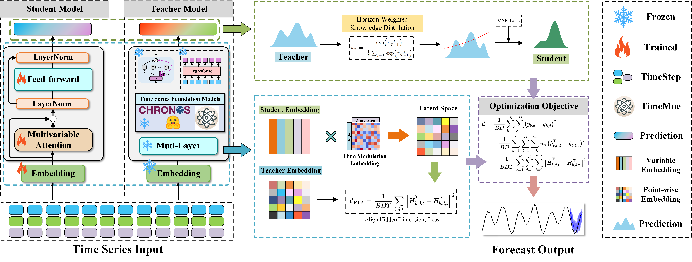
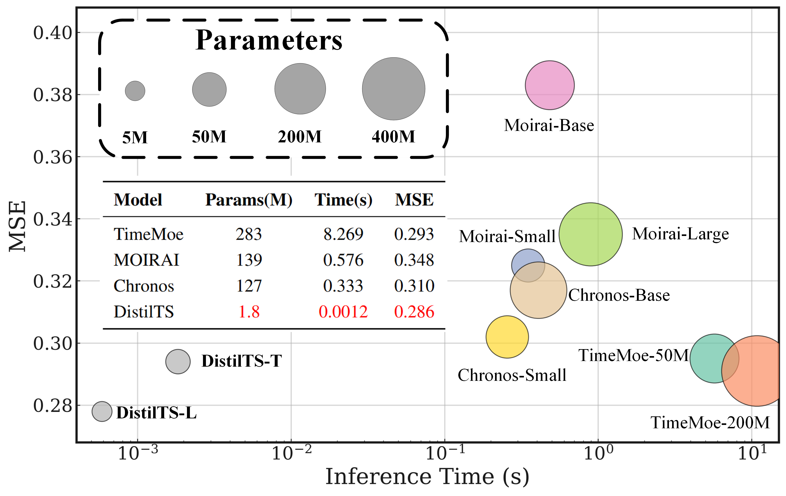

# DistilTS: Distilling Time-Series Foundation Models for Efficient Forecasting

This is the official implementation of our paper:  
**“Distilling Time-Series Foundation Models for Efficient Forecasting”**.  

---

## 1 Framework
The following figure is the framework of DIstilTS:

<p align="center">
  
</p>

---

## 2 Efficiency

DistilTS achieves comparable forecasting performance to large TSFMs while reducing parameters and inference cost by orders of magnitude.  

<p align="center">
  
</p>

---

## 3 Dataset

Prepare Data. You can obtain the well pre-processed datasets from Time-Series-Library. [[Google Drive]](https://drive.google.com/drive/folders/13Cg1KYOlzM5C7K8gK8NfC-F3EYxkM3D2?usp=sharing) or [[Baidu Drive]](https://pan.baidu.com/s/1r3KhGd0Q9PJIUZdfEYoymg?pwd=i9iy), Then place the downloaded data in the folder`./dataset`. Here is a summary of supported datasets.

## 4 Usage

1. Install Python 3.10. For convenience, execute the following command.

```
pip install torch==2.4.1 torchvision==0.19.1  --index-url https://download.pytorch.org/whl/cu121

pip install transformers==4.40.1 accelerate==1.10.1 lightning==2.3.3 \
    gluonts==0.14.4 numpy==1.26.4 pandas==2.1.4 \
    -i https://pypi.tuna.tsinghua.edu.cn/simple
pip install scikit-learn -i https://pypi.tuna.tsinghua.edu.cn/simple
pip install reformer-pytorch -i https://pypi.tuna.tsinghua.edu.cn/simple
pip install uni2ts
pip install chronos-forecasting
pip install -U "ml_dtypes==0.4.0" "jax[cpu]==0.4.28" "jaxtyping==0.2.28"
pip install -U "accelerate==0.31.0"
pip install transformers==4.40.1
```

### 4.1 ChronosBolt

1. **Download the Pre-trained Weights**

```bash
# Example for a mainland-China mirror (uncomment to use)
# export HF_ENDPOINT=https://hf-mirror.com
huggingface-cli download autogluon/chronos-bolt-base --repo-type model --local-dir ./chronos-bolt-base/
huggingface-cli download autogluon/chronos-bolt-small --repo-type model --local-dir ./chronos-bolt-small/
```

### 4.2 TimeMoE

1. **Download the Pre-trained Weights**

```bash
# If your network is restricted, switch to a mirror first:
# export HF_ENDPOINT=https://hf-mirror.com
huggingface-cli download Maple728/TimeMoE-50M  --repo-type model --local-dir ./TimeMoE-50M
huggingface-cli download Maple728/TimeMoE-200M --repo-type model --local-dir ./TimeMoE-200M
```

### 4.3 MOIRAI

```bash
# If your network is restricted, switch to a mirror first:
# export HF_ENDPOINT=https://hf-mirror.com
huggingface-cli download Salesforce/moirai-1.1-R-base  --repo-type model --local-dir ./MOIRAI-base
huggingface-cli download Salesforce/moirai-1.1-R-small  --repo-type model --local-dir ./MOIRAI-small
huggingface-cli download Salesforce/moirai-1.1-R-large  --repo-type model --local-dir ./MOIRAI-large
```

### 4.4 Train

```bash
# Train DIstilTS
bash scripts/TimeMoeDistill/DLinear.sh
bash scripts/TimeMoeDistill/iTransformer.sh
bash scripts/MoiraiDistill/DLinear.sh
bash scripts/MoiraiDistill/iTransformer.sh
bash scripts/ChronosDistill/DLinear.sh
bash scripts/ChronosDistill/iTransformer.sh

## Test TFMs
bash scripts/TimeMoe/ETTh1.sh
bash scripts/TimeMoe/ETTh2.sh
bash scripts/TimeMoe/ETTm1.sh
bash scripts/TimeMoe/ETTm2.sh
bash scripts/TimeMoe/weather.sh
```
## 5 Acknowledgement

We appreciate the following resources a lot for their valuable code and datasets:

- Time-Series-Library (https://github.com/thuml/Time-Series-Library)
- Time-MoE (https://github.com/Time-MoE/Time-MoE)
- Uni2ts (https://github.com/SalesforceAIResearch/uni2ts)
- Chronos (https://github.com/amazon-science/chronos-forecasting)


